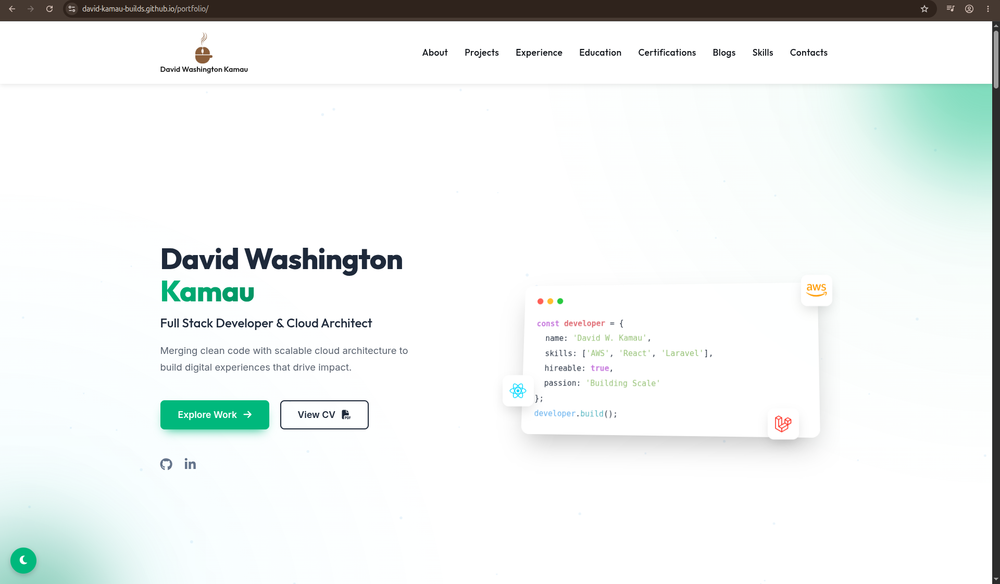
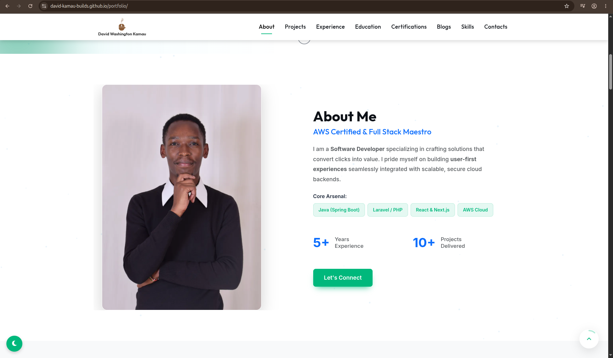
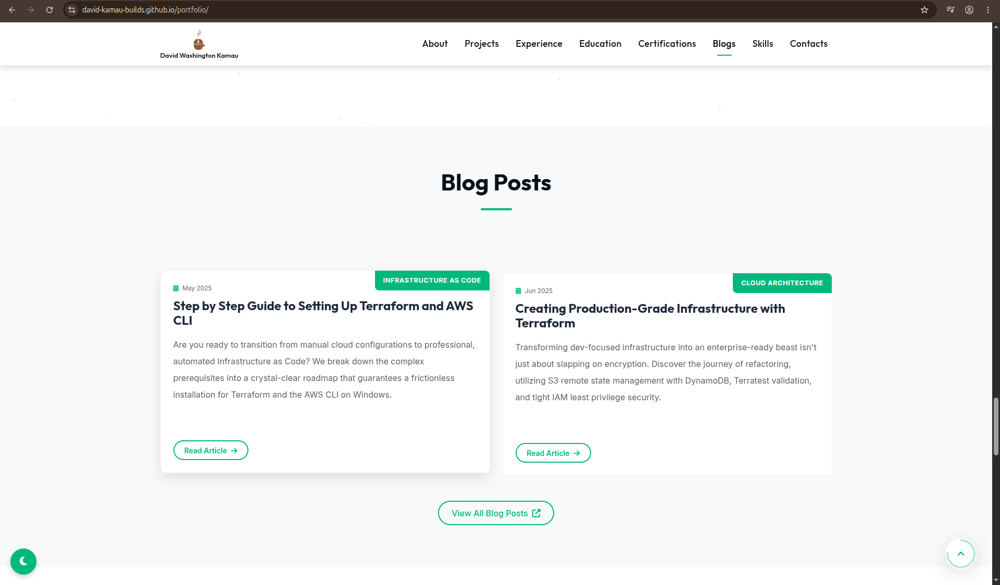
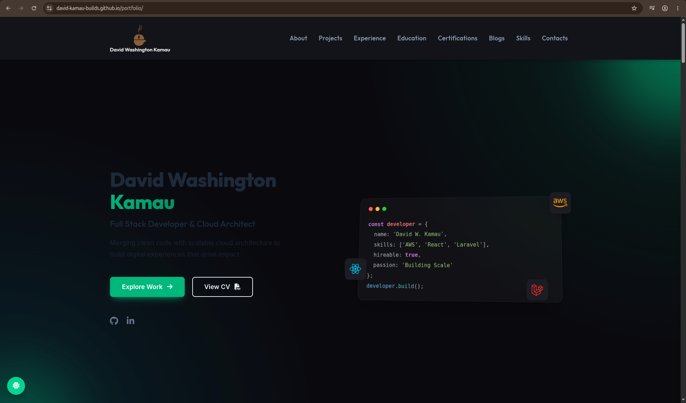
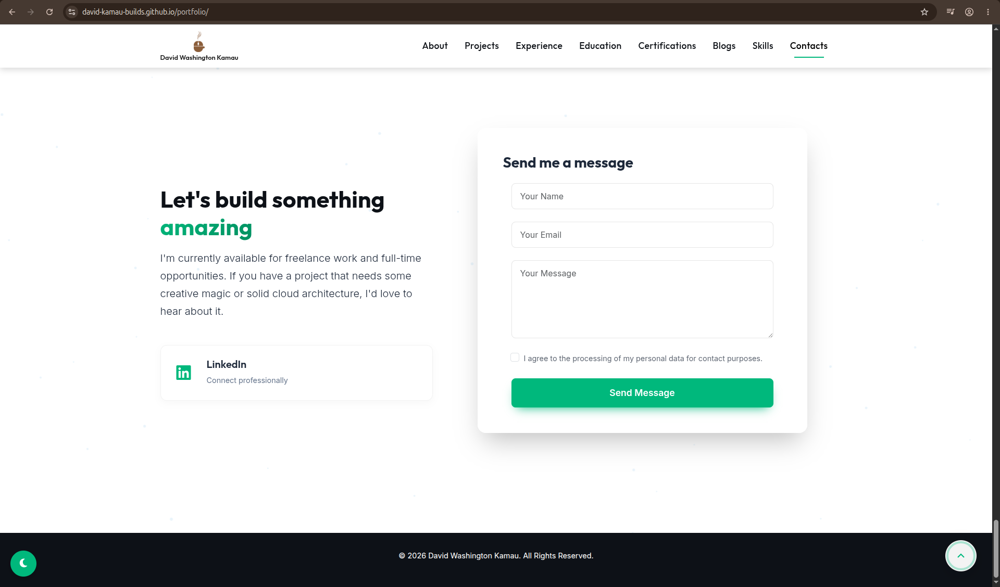

# Day 65: Personal Portfolio Website

## Project Overview
A fully responsive personal portfolio website built with HTML, CSS, and Bootstrap, deployed live on GitHub Pages. The site showcases web design and front-end development skills through a clean, modern layout with sections for skills, projects, and contact information.

🌐 **Live Site:** [david-kamau-builds.github.io/portfolio](https://david-kamau-builds.github.io/portfolio/)

## Key Concepts Learned
- **Responsive Design**: Mobile-first layout using Bootstrap's grid system and custom media queries
- **Bootstrap Components**: Leveraging navbar, cards, buttons, and grid utilities for rapid UI development
- **CSS Custom Properties**: Using variables for a consistent colour and spacing system across the site
- **Smooth Scrolling & Animations**: CSS transitions and scroll-behaviour for a polished user experience
- **GitHub Pages Deployment**: Publishing a static site directly from a GitHub repository

## Technical Skills
- Bootstrap 5 grid system with responsive breakpoints (col-sm, col-md, col-lg)
- CSS Flexbox and Grid for section layouts and card alignment
- Custom CSS animations and hover effects for interactive elements
- Semantic HTML5 elements (header, nav, section, article, footer)
- Font Awesome icons for skills and social links
- Google Fonts integration for typography
- GitHub Pages deployment workflow

## Features
- **Hero Section**: Full-viewport landing with name, title, and call-to-action buttons
- **About Section**: Personal introduction with a profile image
- **Skills Section**: Visual display of technical skills with icons
- **Projects Section**: Project cards with descriptions and links
- **Contact Section**: Contact form and social media links
- **Responsive Layout**: Seamlessly adapts from desktop to mobile
- **Sticky Navbar**: Navigation bar that remains accessible while scrolling

## Screenshots

### Hero Section

### About Section

### Skills Section

### Projects Section

### Project Details

### Contact Section

### Mobile View

### Footer

## Project Structure
- `index.html` - Main HTML file with all page sections
- `css/styles.css` - Custom styles layered on top of Bootstrap
- `images/` - Profile photo and project screenshots

## Setup
1. Clone the repository
2. Open `index.html` in a browser — no build step required
3. Or visit the live site: [david-kamau-builds.github.io/portfolio](https://david-kamau-builds.github.io/portfolio/)
